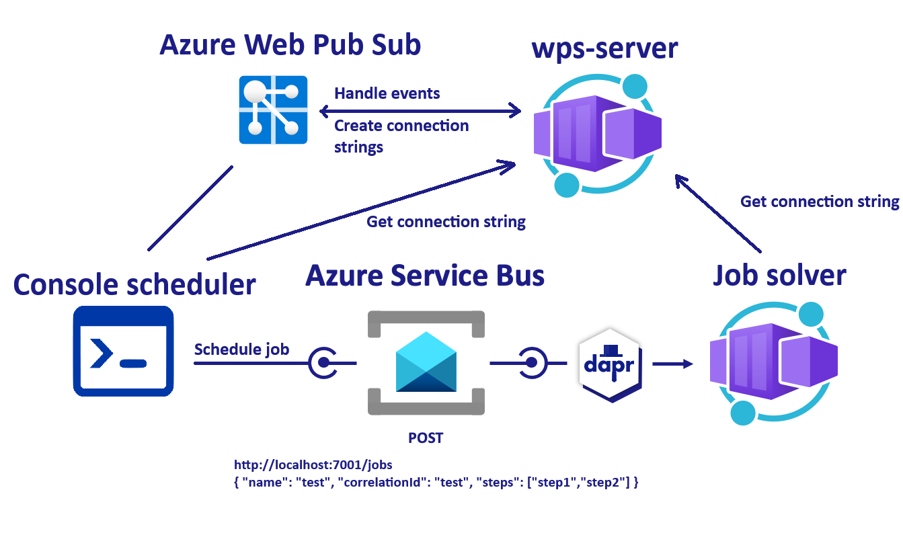

<!-- YAML front-matter schema: https://review.learn.microsoft.com/en-us/help/contribute/samples/process/onboarding?branch=main#supported-metadata-fields-for-readmemd -->

# Microservice communication using pubsub (async) and websockets



In this quickstart, you'll create a subscriber microservice to demonstrate how Dapr enables a publish-subscribe pattern. The publisher will be a console app (`console-scheduler`) that schedules a job on a specific topic, while the subscriber (`job-solver`) will listen for messages on specific topics and execute the job. See [Why Pub-Sub](#why-pub-sub) to understand when this pattern might be a good choice for your software architecture.

The key aspect of this sample is that the console scheduler app communicates with the job solver using websockets. The scheduler app has the ability to "cancel" the job, and the solver sends updates on the job progress.

## Dapr

For more details about this quickstart example, please see the [Pub-Sub Quickstart documentation](https://docs.dapr.io/getting-started/quickstarts/pubsub-quickstart/).

Visit [this](https://docs.dapr.io/developing-applications/building-blocks/pubsub/) link for more information about Dapr and Pub-Sub.

> **Note:** This example leverages the Dapr client SDK. If you are looking for the example using only HTTP [click here](../http).

This quickstart includes one publisher - `console-scheduler`

- Dotnet client console app `console-scheduler`

And one subscriber:

- Dotnet job-solver `job-solver`

There's also an Azure Web Pub Sub server app - `wps-server`, which handles events from Azure Web Pub Sub and includes a `/negotiate` API that allows clients to connect to the web pub sub resource using websockets.

### Prerequisites

For this example, you will need:

- [Dapr CLI](https://docs.dapr.io/getting-started)
- [.NET 6 SDK](https://dotnet.microsoft.com/download)
<!-- IGNORE_LINKS -->
- [Docker Desktop](https://www.docker.com/products/docker-desktop)
<!-- END_IGNORE -->

### Deploy apps to Azure (Azure Container Apps, Azure Service Bus)

#### Deploy to Azure for dev-test

NOTE: Make sure you have Azure Dev CLI prerequisites [here](https://learn.microsoft.com/en-us/azure/developer/azure-developer-cli/install-azd?tabs=winget-windows%2Cbrew-mac%2Cscript-linux&pivots=os-windows) and are on version 0.9.0-beta.3 or greater.

1. Run the following command to initialize the project:

```bash
azd init --template https://github.com/karpikpl/azure-web-pub-sub-sample
```

This command will clone the code to your current folder and prompt you for the following information:

- `Environment Name`: This will be used as a prefix for the resource group that will be created to hold all Azure resources. This name should be unique within your Azure subscription.

2. Run the following command to package a deployable copy of your application, provision the template's infrastructure to Azure, and deploy the application code to those newly provisioned resources:

```bash
azd up
```

This command will prompt you for the following information:
- `Azure Location`: The Azure location where your resources will be deployed.
- `Azure Subscription`: The Azure Subscription where your resources will be deployed.

> NOTE: This may take a while to complete as it executes three commands: `azd package` (packages a deployable copy of your application), `azd provision` (provisions Azure resources), and `azd deploy` (deploys application code). You will see a progress indicator as it packages, provisions, and deploys your application.

#### Azure Role Assignments

Deployment will attempt to create role assignments for the resources, as well as the identity executing the deployment. In scenarios where the `Subscription Owner` role is not available, the following role assignments have to be added manually by the admin for the **user-assigned managed identity** created during the deployment:

* `Azure Service Bus Data Sender`
* `Azure Service Bus Data Receiver`
* `Azure Container Registry Pull`
* `Web PubSub Service Owner`

Optional access for users running the app locally:
* `Azure Service Bus Data Sender`
* `Azure Service Bus Data Receiver`
* `Web PubSub Service Owner`

#### Run the console scheduler

Once the infrastructure is deployed, `appsettings.local.json` files will be created for all projects.

To schedule a job, run `dotnet run` from the `console-scheduler` directory.

There are two other test projects that just verify Azure Web Pub Sub is working:
- `console-publisher` - sends messages to all subscribers.
- `console-subscriber` - subscribes to messages from Web Pub Sub.

## Message Delivery Guarantees

The sample uses the [Azure Web PubSub Reliable JSON WebSocket subprotocol](https://learn.microsoft.com/en-us/azure/azure-web-pubsub/reference-json-reliable-webpubsub-subprotocol).

1. Group Message Delivery:
    * When you send a message to a group, Azure Web PubSub ensures that the message is delivered to all connected clients in that group.
    * However, there is no built-in acknowledgment mechanism to confirm that each client has received the message. The server does not get an ACK for group messages.

2. Client-to-Server ACK:

    * When clients send messages directly to the server, the Reliable JSON WebSocket subprotocol can provide acknowledgments (ACKs) to confirm that the server has received the message.
    * This ensures that the client knows whether the message was successfully delivered to the server.

3. Message Redelivery on Client Restart:

    * If a client disconnects and then reconnects, the Reliable JSON WebSocket subprotocol can handle message redelivery.
    * The client can resume the WebSocket connection and request any missed messages from the server. This ensures that no messages are lost during the disconnection period. This however applies to SDK client reconnecting by itself, not closing/restarting the client.

Summary:

* **Group Message Delivery**: No ACKs for individual clients; delivery is best-effort.
* **Client-to-Server ACK**: ACKs are provided to confirm message receipt by the server.
* **Message Redelivery**: Supported on SDK client restart to ensure no message loss.
* **Server-to-Client ACK**: ACKs are provided to confirm message reciept by the server, no that a client received it (or that the client exists or is connected).

These reliability features help ensure that messages are delivered as expected, even in the presence of network disruptions or client restarts.

### Client-to-client messages

Since client-to-server messages are confirmed by ACK, one way for two clients to communicate is via server message routing. This way, the server can confirm messages were delivered.

For example, if Client A sends a message to the server -> the server reads the target client ID from the message -> sends the message to Client B.

Client A gets an ACK from the server when the server successfully receives the message from A. When using the reliable subprotocol, Client B is guaranteed to receive the message from A even if Client B is disconnected and reconnected during this period. However, if Client A is expecting some ACK from B, then B needs to send some application layer ACK message to A. Such ACK is not supported at the reliable subprotocol level.

The only way to achieve reliable communication between clients is to implement "read receipts", where each client confirms the message delivery.